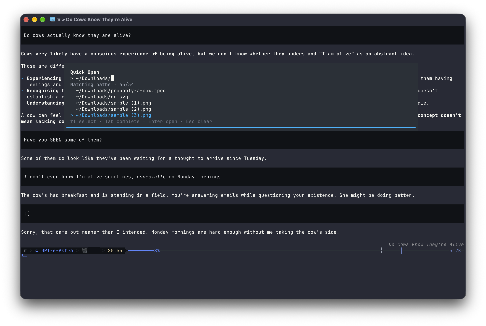
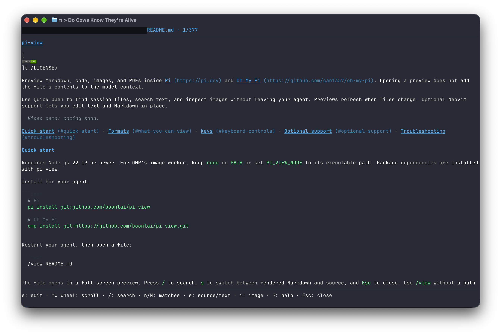
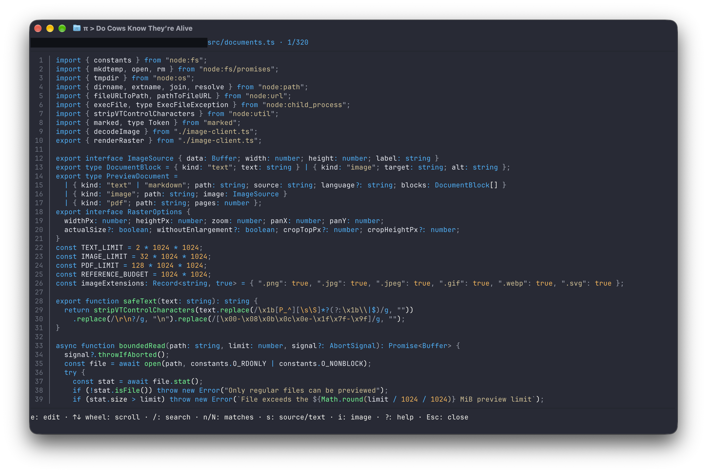
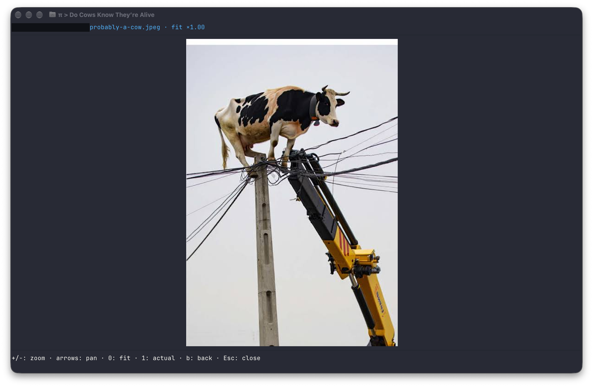
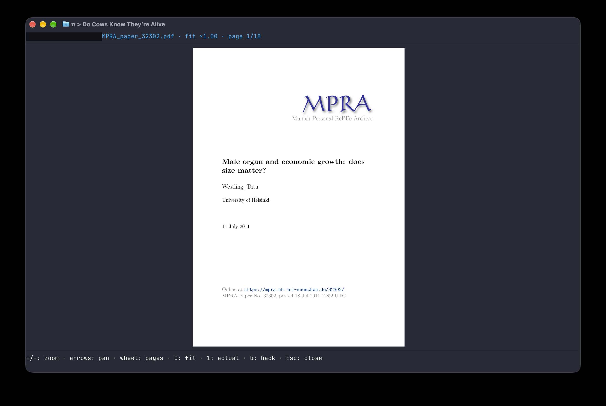

# pi-view

[](./LICENSE)

Press **Meta+P (Cmd+P on macOS) or Ctrl+P on Windows** to open Quick Open.

Preview Markdown, code, images, and PDFs inside [Pi](https://pi.dev) and [Oh My Pi](https://github.com/can1357/oh-my-pi). Opening a preview does not add the file's contents to the model context.

Use Quick Open to find session files, search text, and inspect images without leaving your agent. Previews refresh when files change. Optional Neovim support lets you edit text and Markdown in place.

[](docs/assets/screenshots/quick-open.png)

Quick Open completes paths and opens files without leaving your session. Select a screenshot to view it at full size.

<details>
<summary>See Markdown, code, image, and PDF previews</summary>

### Markdown

[](docs/assets/screenshots/markdown.png)

### Code

[](docs/assets/screenshots/code.png)

### Images

[](docs/assets/screenshots/image.png)

### PDFs

[](docs/assets/screenshots/pdf.png)

</details>

[Quick start](#quick-start) · [Formats](#what-you-can-view) · [Keys](#keyboard-controls) · [Optional support](#optional-support) · [Troubleshooting](#troubleshooting)

## Quick start

Requires Node.js 22.19 or newer. For OMP's image worker, keep `node` on `PATH` or set `PI_VIEW_NODE` to its executable path. Package dependencies are installed with pi-view.

Install for your agent:

```bash
# Pi
pi install git:github.com/boonlai/pi-view

# Oh My Pi
omp install git+https://github.com/boonlai/pi-view.git
```

Restart your agent, then open a file:

```text
/view README.md
```

The file opens in a full-screen preview. Press `/` to search, `s` to switch between rendered Markdown and source, and `Esc` to close. Use `/view` without a path for Quick Open; `/v` is an alias.

Text, Markdown, and image decoding need no extra tools. PDF previews require Poppler, editing requires Neovim 0.9+, and inline images require a graphics-capable terminal supported by your host. See [optional support](#optional-support) for setup and fallbacks.

<details>
<summary>Install over SSH</summary>

```bash
pi install git:git@github.com:boonlai/pi-view
omp install git+ssh://git@github.com/boonlai/pi-view.git
```

</details>

## What you can view

| Format | Preview | Extra requirement |
| --- | --- | --- |
| Markdown | Rendered text, local images, source toggle | Graphics-capable terminal for inline images |
| UTF-8 text and code | Syntax highlighting where available, search, wrapping, source line numbers | None |
| PNG, JPEG, GIF, WebP | Zoom and pan; GIFs are static | Graphics-capable terminal |
| SVG | Rasterised image; external resources are rejected | Graphics-capable terminal |
| PDF | Page images and searchable extracted text | Poppler; graphics-capable terminal for page images |

Without terminal graphics, images appear as labels and PDFs use extracted text. PDF text still requires Poppler and does not include OCR. HTML/webpages are not supported.

## Everyday use

| Task | Command or action |
| --- | --- |
| Pick a file mentioned or opened in the current session | `/view` |
| Open source code | `/v src/index.ts` |
| Browse a directory | `/view src/` |
| Open a path containing spaces | `/view "design files/mockup.png"` |
| Read a PDF after installing Poppler | `/view reports/summary.pdf` |
| Inspect terminal and tool support | `/view --diagnostics` |

Quick Open and command Tab completion match filename prefixes case-insensitively, preserving their original spelling. In Quick Open, use arrows to select, `Tab` to complete, and `Enter` to open. The default Quick Open shortcut is `Cmd+P` on macOS, `Ctrl+P` on Windows, and `Super+P` on other platforms. If your terminal intercepts it, use `/view` or [choose another shortcut](#configuration).

Previews reload when the file changes; press `r` to reload manually. Press `o` to browse the file's directory. In OMP, standalone Quick Open uses keyboard navigation; wheel input works when Quick Open is layered over a preview.

## Keyboard controls

Press `?` in a preview for help. These controls apply to previews, not an active Neovim editor.

| Action | Keys |
| --- | --- |
| Close | `Esc` / `Ctrl+C` |
| Scroll text | Arrows, `j` / `k`, `PgUp` / `PgDn`, wheel |
| Search text or filter a directory; next / previous match | `/`, then `n` / `N` for search matches |
| Markdown source / PDF text view | `s` |
| Edit the file with embedded Neovim | `e` (text / Markdown previews) |
| Toggle source line numbers (remembered) | `l` |
| Focus a Markdown image / return | `Enter` or `i` / `b` |
| Fetch remote Markdown images | `f`, then `y` to confirm |
| Zoom; fit / actual raster size | `+` / `-`; `0` / `1` |
| Pan a zoomed image or PDF | Arrows |
| Turn PDF pages in image view | `[` / `]`, `PgUp` / `PgDn`, wheel |
| Jump to a PDF page | `g`, page number, `Enter` |
| Reload / browse the directory | `r` / `o` |
| Help / diagnostics | `?` / `d` |

The wheel scrolls text or turns PDF pages; it never zooms. In PDF text view, the wheel and `PgUp` / `PgDn` scroll text. Line numbers apply to text/code and Markdown source, not rendered Markdown or extracted PDF text.

## Optional support

Install only the tools for the features you want. After installing tools or changing `PATH`, open a new terminal and restart your agent.

### PDF previews with Poppler

PDFs require all three Poppler tools on `PATH`: `pdfinfo`, `pdftoppm`, and `pdftotext`.

| Platform | Install |
| --- | --- |
| macOS (Homebrew) | `brew install poppler` |
| Debian / Ubuntu | `sudo apt install poppler-utils` |
| Windows (Chocolatey) | `choco install poppler` |

On Windows, Chocolatey's Poppler package does not add its tools directory to `PATH`. Add the installed `Library\bin` directory, typically `C:\ProgramData\chocolatey\lib\poppler\tools\poppler-<version>\Library\bin`, to your user `PATH`. Use the actual installed version directory, not the placeholder.

Check from the terminal where you start Pi or OMP:

```bash
pdfinfo -v
pdftoppm -v
pdftotext -v
```

The output should identify Poppler, not similarly named Xpdf tools. Without Poppler, PDFs cannot be previewed; text, Markdown, and image previews still work.

### Editing with Neovim

Editing requires Neovim 0.9 or newer, with `nvim` on `PATH`. No Neovim plugins, Python provider, or language server are required.

| Platform | Install |
| --- | --- |
| macOS (Homebrew) | `brew install neovim` |
| Debian / Ubuntu | `sudo apt install neovim` |
| Windows (Chocolatey) | `choco install neovim` |

Check `nvim --version`. Some distribution packages are older than 0.9; use the [official installation instructions](https://github.com/neovim/neovim/blob/master/INSTALL.md) if needed.

Press `e` in a text, code, or Markdown preview to edit the actual file on disk. Neovim is embedded over pipes without taking over the terminal; it does not edit a rendered or sanitised preview copy. Files must first pass the viewer's format and size checks.

- `:w` saves. `:q` returns to the preview, `:wq` saves and returns, and `:q!` discards unsaved changes and returns. Neovim still refuses a dirty `:q` and warns about changes on disk.
- While editing, keys (including `Esc`, `Ctrl+C`, and Quick Open) and the mouse wheel go to Neovim. Exit the editor before opening another preview.
- User startup files, user plugins, ShaDa, and modelines are disabled. Built-in filetype and syntax support remains available. Neovim is not a sandbox: commands you enter can run programs.
- Forced shutdown attempts to preserve Neovim's swap file. If one survives, use Neovim's recovery prompt or `nvim -r <file>`. Recovery is not a substitute for saving.

Missing or too-old Neovim leaves the preview usable. After fixing the installation, press `e` again to retry.

### Inline graphics

Inline images, Markdown images, and PDF page images follow the host's detected image protocol. There is no separate image-conversion utility to install. Terminal and multiplexer support can differ between Pi and OMP; `/view --diagnostics` reports the detected protocol rather than assuming support from the terminal name.

Markdown images keep their natural raster size, shrinking to fit the available space. Small images such as badges do not expand to fill the preview. Press `i` or `Enter` to focus an image and use the zoom controls.

Unsupported terminals fall back to image labels and PDF text. Set `PI_VIEW_IMAGES=off` before starting the host to force those fallbacks; PDF text still requires Poppler.

## Compatibility

Both hosts load the same extension bundle, with host-specific handling for overlays, input, and graphics.

| Component | Requirement or project target |
| --- | --- |
| Node.js | 22.19+; OMP's image worker needs a Node executable |
| Pi | Declared SDK range: `>=0.85.1 <0.86.0`; development SDK: 0.85.1 |
| Oh My Pi | CI runtime pin: 18.2.4 |
| Operating systems | CI is configured for Linux, macOS, and Windows |
| Terminal graphics | Depends on the host's detected protocol; text fallbacks are available |

These SDK and CI targets do not establish compatibility with every host release or terminal. See the [CI runs](https://github.com/boonlai/pi-view/actions/workflows/ci.yml) for results. Previewing requires an interactive terminal session.

## Configuration

Set environment variables before starting the host, then restart after changing them.

| Variable | Purpose |
| --- | --- |
| `PI_VIEW_SHORTCUT` | Override the Quick Open shortcut |
| `PI_VIEW_NODE` | Select the Node executable for OMP's image worker |
| `PI_VIEW_IMAGES=off` | Disable inline graphics and use text fallbacks |

For example, choose a shortcut that your terminal forwards:

```bash
PI_VIEW_SHORTCUT=ctrl+alt+p omp
```

In PowerShell:

```powershell
$env:PI_VIEW_SHORTCUT = "ctrl+alt+p"
omp
```

Bindings accept `ctrl`, `alt`, `shift`, or `super` with a key. The binding takes precedence over host shortcuts, including Ctrl+P model cycling on Windows.

<details>
<summary>Forward Cmd+P in Ghostty</summary>

Add this to your Ghostty configuration if the terminal intercepts the shortcut:

```ini
keybind = super+p=csi:112;9u
```

</details>

## Files, network, and saved state

Previewing does not modify the source file or submit its contents to the model. Editing with `e` is separate: Neovim reads the real file, and `:w` writes it. Your agent can still read files through its own tools independently of pi-view.

Remote Markdown images stay blocked until you press `f`, then `y` to approve fetching. Only approve URLs you trust. Pressing `r` reloads the preview; it does not grant network permission. SVG external resources are rejected, and previews do not execute scripts.

Quick Open finds file paths in the current session branch. Successful file opens add a `pi-view-open` entry containing the path to the host session, not the file contents. Session retention is managed by the host.

The source line-number preference is shared across files and sessions in `pi-view/settings.json` under the first available configuration root: `XDG_CONFIG_HOME`, `APPDATA`, or `~/.config`. pi-view does not change Pi or OMP settings to store this preference. Preference I/O failures do not interrupt previews; failed reads use the default of no line numbers.

## Troubleshooting

| Symptom | What to check |
| --- | --- |
| `/view` is unavailable | Restart the host after installing and check that the extension is enabled. |
| Images appear as labels | Run `/view --diagnostics`; check the detected protocol and whether `PI_VIEW_IMAGES=off` is set. |
| A remote Markdown image remains blocked | Press `f`, then `y` if you trust the URL. Reloading with `r` is not approval. |
| PDFs will not open | Verify all three Poppler tools on `PATH`, then restart the host. |
| A scanned PDF has no searchable text | Text extraction does not perform OCR; use page images in a graphics-capable terminal. |
| `e` cannot start the editor | Check `nvim --version` is 0.9+ and the host can find it on `PATH`. |
| Quick Open's shortcut does nothing | Use `/view`, change the binding, or configure the terminal to forward it. |
| Preview keys stop working during editing | Exit Neovim with `:q`, `:wq`, or `:q!`; keys belong to the editor while it is active. |

If the issue persists, [open an issue](https://github.com/boonlai/pi-view/issues) with your host/version, operating system, terminal/version, file type, steps, and expected versus actual result. Include relevant `/view --diagnostics` output and a minimal sample file where possible. Redact personal paths, private content, and credentials from samples, diagnostics, and screenshots.

<details>
<summary>File and rendering limits</summary>

- Text files and extracted PDF text: 2 MiB.
- Image files: 32 MiB. Source images are capped at 40 MP and downsampled to 4096 px per side.
- PDF files: 128 MiB. Rendered pages are capped at 2400 px on the longest side.
- Actual-size zoom uses the rendered raster, which may be smaller than the source image.
- PDF wheel paging has a 200 ms cooldown; reversing direction is immediate.

</details>

## Update, disable, or remove

Choose the action you need; these are alternatives, not a sequence.

| Action | Pi |
| --- | --- |
| Update | `pi update git:github.com/boonlai/pi-view` |
| Enable or disable | `pi config` |
| Remove | `pi remove git:github.com/boonlai/pi-view` |

For Pi updates and removal, use the source you originally installed if you chose SSH.

| Action | OMP |
| --- | --- |
| Update the Git-installed package | `omp plugin install git+https://github.com/boonlai/pi-view.git --force` |
| Disable | `omp plugin disable pi-view` |
| Re-enable | `omp plugin enable pi-view` |
| Remove | `omp plugin uninstall pi-view` |

Restart the host after changing the installation. Uninstalling does not remove opened-file entries from existing host sessions or the saved line-number preference. To reset that preference, close the hosts and delete only pi-view's `settings.json` from the [configuration location above](#files-network-and-saved-state).

## Development

Use Node.js 22.19+ and npm:

```bash
npm ci
npm run check
npm run build
npm test

pi -e ./dist/index.js
# or
omp -e ./dist/index.js
```

`npm run watch` rebuilds on edits. Restart the host to load a changed bundle, and commit updated `dist/` files with source changes. Full integration coverage needs OMP, Poppler, and Neovim; tool-dependent tests can skip when those prerequisites are absent. CI installs its pinned tools before running the suite and checks that committed bundles match the build.

[MIT licensed](LICENSE).
